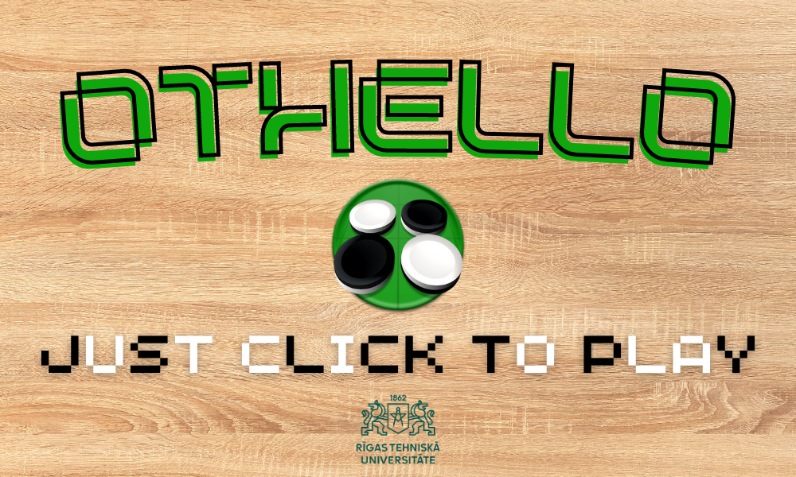
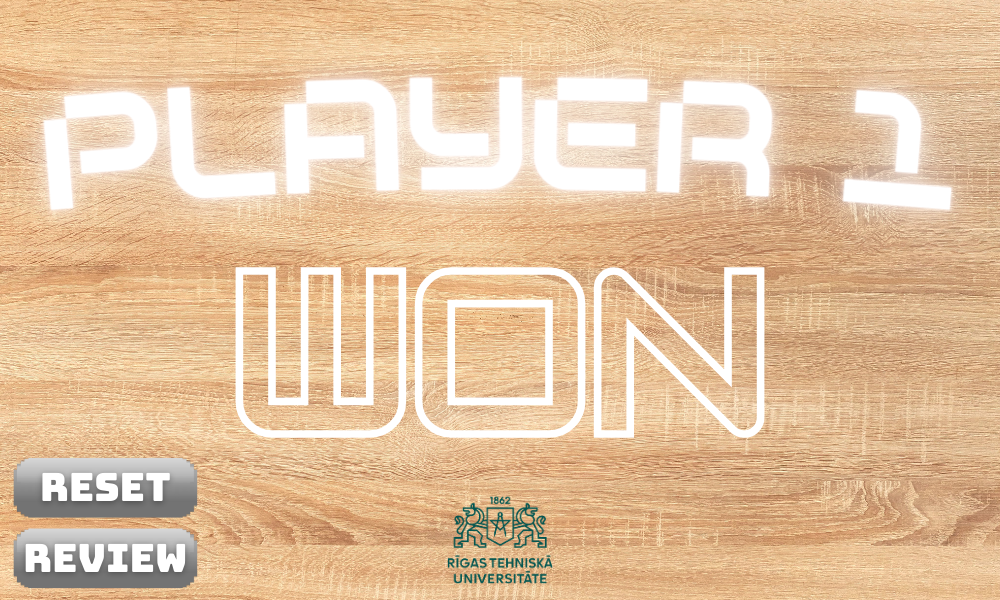
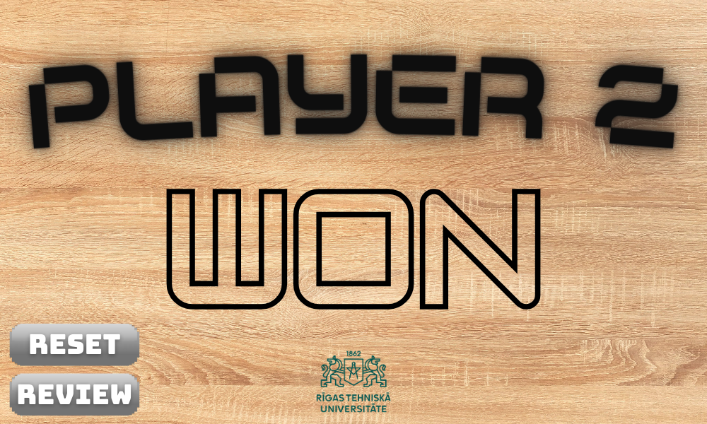

# Othello 
Development of the well known othello/reversi game on python with implementation of an intelligent bot based on a heuristic minimax algorithm

## Game displays

### Launching

The user can choose his colour for the whole game. The white color always starts. The other colour will be played by an implemented AI (easy level by default).

### Playing

The user can see all his available moves with the small grey circles. He just have to click on a valid position on the board to make a move. After that, the AI will play with a little delay and it will be his turn again.

On the left part of the screen, there are some informations like the color of the user, the score or the possibility to change the difficulty and reset the game.

### Ending

When the game ends, the screen changes to show who won the game. However, it stays possible for the user to review the game in order to understand or to check something. 
After that, the reset button allows to play a new game.

### AI process

The AI process is based on the minimax algorithms with an heuristic function that can evaluate a specific grid (thanks to the number of flipped pieces, the score, the position of the move in the matrix...).
